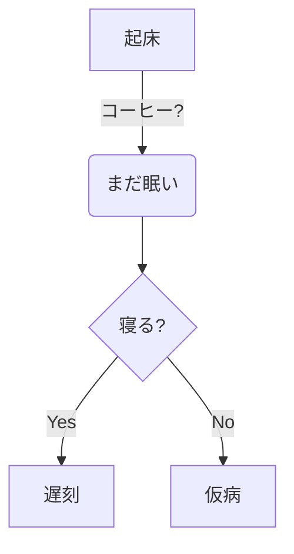
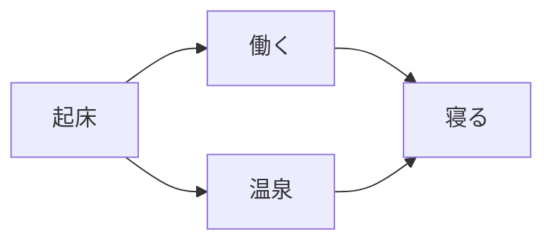

# Zenn CLI

* [📘 How to use](https://zenn.dev/zenn/articles/zenn-cli-guide)

# Commands 📝

1. create new article
    ```
    npx zenn new:article
    npx zenn new:article --slug 記事のスラッグ --title タイトル --type idea --emoji ✨
    ```

2. create new book
    ```
    npx zenn new:book
    ```
    
3. preview
    ```
    npx zenn preview
    ```


# 見出し1です
## 見出し2だね
### 見出し3かな
#### 見出し4デス
---

- こんちわ!
- おはようございます!
  - こんばんわ!
  * こんばんにちわ!
---

1. 一番目
2. 二番目
---

[アンカーテキスト](#%E8%A6%8B%E5%87%BA%E3%81%971%E3%81%A7%E3%81%99)

---


*Zenn*

[](https://zenn.dev/)
*Zenn webページ(キャプションが中央に来ない)*


---

| タスク1 | タスク２ | タスク３ |
| ---- | ---- | ---- |
| 終わらない | 終わったはず | 忘れた |
| 😅 | 知らない | まじ？ |

---

```js
シンプルコード
```

```js:hey.hey
コード+ファイル名
```

```diff js:hey.hey
@@ -4,6 +4,5 @@
+    const foo = bar.baz([1, 2, 3]) + 1;
-    let foo = bar.baz([1, 2, 3]);
```

$$
e^{i\theta} e^{-i\theta} = (\cos\theta + i\sin\theta)e^{-i\theta}
$$

---

> 引用文..etc


> 脚注の例[^1]です。インライン^[脚注２はインライン]で書くこともできます。

[^1]: 脚注の内容その1（別々に書いたほうが可読性が高い）

---


*イタリック🇮🇹*
**太字**
~~打ち消し線~~
インラインで`python hey.py`を挿入する

<!-- TODO: ◯◯について追加しなければならない -->


:::message
ワーニングっぽいメッセージ
:::

:::message alert
⚠️警告っぽいメッセージ
:::

:::details アコーディオン(タイトル)
ここへコメント
:::

::::details タイトル
:::message
ネストされた要素
:::
::::

https://github.com/testkun08080


# ポストのURLだけの行（前後に改行が必要です）
https://twitter.com/jack/status/20

# x.comドメインの場合
https://x.com/jack/status/20

# YouTubeのURLだけの行（前後に改行が必要です）

https://youtu.be/l0GN40EL1VU?si=Ba7Ulv9sVqkn5KDe
*ずっと聴いていられる*

# GitHubのファイルURLまたはパーマリンクだけの行（前後に改行が必要です）
https://github.com/testkun08080/testkun08080/blob/main/README.md


# コードの開始行と終了行を指定
https://github.com/testkun08080/testkun08080/blob/main/README.md#L1-L6

# コードの開始行のみ指定
https://github.com/testkun08080/testkun08080/blob/main/README.md#L6


### Gist
@[gist](https://gist.github.com/testkun08080/bc4c7700d215ebf57a7f07731a03035a)


### Codepen (猫はいつもいいね🐈)
@[codepen](https://codepen.io/firletta/pen/WbeJLXY)

### Slideshare (大共感)
@[slideshare](https://www.slideshare.net/slideshow/guide-of-hanayama-onsen-by-programmer-onsen/273970196)

### Speakerdeck (フィンランドサウナはいつか行ってみたい)
@[speakerdeck](0c1fafbb6d51488688227b18de098c28)

### Docswell (またねこ)
@[docswell](https://www.docswell.com/s/karaage0703/K7VPJG-2024-02-22-203253#p1)


### codesandbox (やはり猫)
@[codesandbox](https://codesandbox.io/embed/cat-chat-in-react-jefdn)

### Stackblitz (もう一度猫)
@[stackblitz](https://stackblitz.com/edit/angular-cat-breeds?embed=1&file=src%2Fapp%2Fapp.component.ts)


### figma (ミーム行ってみよう)
@[figma](https://www.figma.com/proto/L9nFyfVDGrNpQETo9fm67Z/Figma-Meme-Templates--Community-?node-id=2-2&t=hSwyuZtUdeYGL4Yk-1)


### blueprintue (特に面白いのが見つからないのでサンプル通り)
@[blueprintue](https://blueprintue.com/render/0ovgynk-/)





