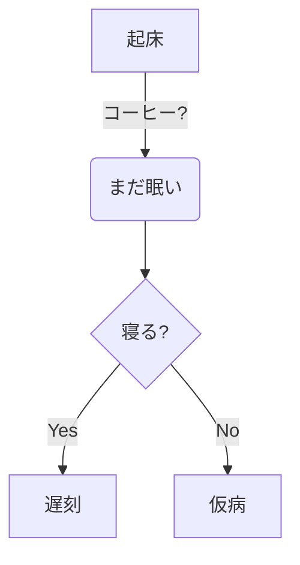
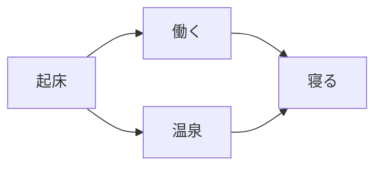

### Gist
@[gist](https://gist.github.com/testkun08080/bc4c7700d215ebf57a7f07731a03035a)

### Codepen (猫はいつもいいね🐈)
@[codepen](https://codepen.io/firletta/pen/WbeJLXY)

### Slideshare (大共感)
@[slideshare](nTrXFa4nUPfgDK)

### Speakerdeck (フィンランドサウナはいつか行ってみたい)
@[speakerdeck](0c1fafbb6d51488688227b18de098c28)

### Docswell (またねこ)
@[docswell](https://www.docswell.com/s/karaage0703/K7VPJG-2024-02-22-203253#p1)

### codesandbox (やはり猫)
@[codesandbox](https://codesandbox.io/embed/cat-chat-in-react-jefdn)

### Stackblitz (もう一度猫)
@[stackblitz](https://stackblitz.com/edit/angular-cat-breeds?embed=1&file=src%2Fapp%2Fapp.component.ts)

### figma (ミーム行ってみよう)
@[figma](https://www.figma.com/proto/L9nFyfVDGrNpQETo9fm67Z/Figma-Meme-Templates--Community-?node-id=2-2&t=hSwyuZtUdeYGL4Yk-1)

### blueprintue (特に面白いのが見つからないのでサンプル通り)
@[blueprintue](https://blueprintue.com/render/0ovgynk-/)

