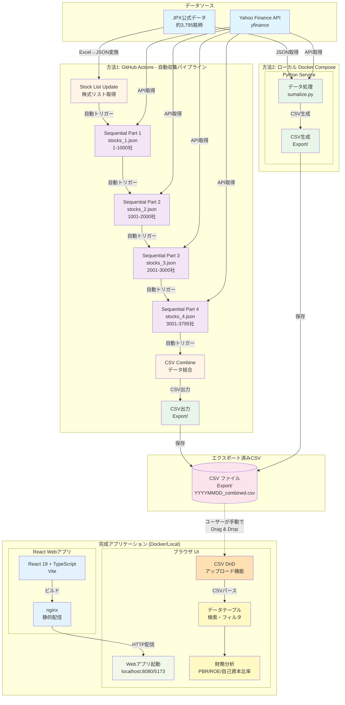

# はじめに/作ったわけ

:::message
**バイブコーディングで作ったアプリの記事になります**
:::

いきなりですが。
海外で働き始めたり旅行したりすると、日本の良さが身に染みたと感じた人は多いんじゃないでしょうか？
なんかとりあえず外で働いてみたいと思っていましたが、今はいつ戻るかと考える日々です。（とにかく温泉に入りたい）

また色々と各国を回る中で、日本企業ってアジア圏や他の国にもかなり進出してるんだなぁと実感しました。（そりゃそう）

そんなこんなで日本株に興味を持ち
昨年に[わが投資術](https://amzn.to/3IEVRkq)を参考にさせていただきながら実践し始めました。（まだ初めて一年目なので成績はわかりません。。。が、マイナスは無し）

自分でバフェットコードや Claude yfinance mcp などを利用しながらスクリーニングしてみましたが、毎回決算が出るたびに手動とチャット相手にあるのも何かなぁ。と思いまして。

じゃあ自動収集とスクリーニング用のアプリ作ってみよう(vibe coding)

そんなノリから、**日本株全銘柄を自動収集・簡易スクリーニングできる Web アプリ**を開発しました。

この記事では、粗方の工程と実際にローカルでこれを試す方法を紹介します。
細かいコードなどはそこまで期待しないでください 😅

## 作ったもの

### 📊 [yfinance-jp-screener](https://github.com/testkun08080/yfinance-jp-screener)


_検索部分_

_検索結果(企業名はここでは伏せておきます)_

**主な機能:**

- 📈 JPX 公式データから約 3,795 銘柄を自動取得
- 🔍 財務指標による高速スクリーニング
- 📊 PBR、ROE、自己資本比率などの指標可視化
- ⚙️ GitHub Actions による自動データ収集
- 🐳 Docker 簡単デプロイ

# 「わが投資術」との出会い

[わが投資術](https://amzn.to/3IEVRkq)では、**シンプルな指標**で割安株を見つける手法が紹介されています：

- **時価総額**: 500 億以下
- **PBR**: 1 倍以下
- **PER**: 10 倍以下
- **ネットキャッシュ**: （流動資産＋投資有価証券 ×70％）－負債
- **ネットキャッシュ比率**　ネットキャッシュ/時価総額

これらの指標を**自動で取得・分析**できれば、ひとまず「わが投資術」に粗方沿ったスクリーニングができると思います。
なので、これらの基本的なものに加えて、以下のものをフィルタリング出来るようにしていきます。

### 実装済みフィルタリング項目

#### 📋 基本フィルター


- **会社名検索** - テキスト検索（部分一致）
- **銘柄コード検索** - コード検索
- **時価総額** -
- **業種** - 複数選択可能（チェックボックス）
- **優先市場** - プライム/スタンダード/グロース（複数選択）
- **都道府県** - 本社所在地による絞り込み（複数選択）

#### 📊 バリュエーション指標


- **PBR（株価純資産倍率）**
- **ROE（自己資本利益率）**
- **自己資本比率**
- **PER(会予)（予想株価収益率）**

#### 💹 業績・収益性指標


- **売上高**
- **営業利益**
- **営業利益率**
- **当期純利益**
- **純利益率**

#### 🏛️ バランスシート指標


- **負債**
- **流動負債**
- **流動資産**
- **総負債**
- **投資有価証券**

#### 💰 キャッシュ関連指標


- **現金及び現金同等物**
- **ネットキャッシュ**
- **ネットキャッシュ比率**

# 技術スタック

## アーキテクチャ

```text
┌─────────────────────────────────────────────────┐
│            データソース (JPX公式 + Yahoo Finance)  │
└────────┬───────────────────────────────┬────────┘
         │                               │
         ↓                               ↓
┌────────────────────┐        ┌─────────────────────┐
│  GitHub Actions    │        │ ローカル環境          │
│  (CI/CD自動収集)    │        │ (Docker Compose).   │
│                    │        │                     │
│  Part 1-4          │        │  Python Service     │
│  → CSV Combine     │        │  → CSV生成           │
└────────┬───────────┘        └─────────┬───────────┘
         │                               │
         ↓                               ↓
┌─────────────────────────────────────────────────┐
│            CSV ファイル (Export/)                │
└────────┬────────────────────────────────────────┘
         │
         ↓
┌─────────────────────────────────────────────────┐
│         React フロントエンド (Docker/Local)      　│
│  CSV Drag & Drop → 検索・フィルタ → 結果表示        │
└─────────────────────────────────────────────────┘
```

:::details 詳細



:::

## データ収集（Python）

- **Python 3.11+**
- **yfinance**

## フロントエンド（React）

- **React 19**
- **TypeScript**
- **Vite**
- **Tailwind CSS + DaisyUI**

## インフラ

- **GitHub Actions**
- **Docker Compose**

# 開発のポイント

## 1. データ収集の自動化

### 課題: yfinance API のレート制限

約 3,795 社のデータを Github Actions で一度に取得すると、API のレート制限やタイムアウトが発生します。
（管理上も分けたかったという意図もあります。）

### 分割処理

GitHub Actions で**4 段階のワークフロー**を構築し、自動連携させました。

```yaml
# Part 1 → Part 2 → Part 3 → Part 4 → CSV結合
Sequential Stock Fetch - Part 1 (stocks_1.json: 1,000社)
  ↓ 自動トリガー
Sequential Stock Fetch - Part 2 (stocks_2.json: 1,000社)
  ↓ 自動トリガー
Sequential Stock Fetch - Part 3 (stocks_3.json: 1,000社)
  ↓ 自動トリガー
Sequential Stock Fetch - Part 4 (stocks_4.json: 795社)
  ↓ 自動トリガー
CSV Combine & Export (全データ結合)
```

### 実装コード（ワークフロー連携部分）

```yaml
name: 📊 Sequential Stock Fetch - Part 1

permissions:
  contents: write
  actions: write

on:
  workflow_dispatch:
    inputs:
      reason:
        description: "開始理由（オプション）"
        required: false
        default: "Sequential stock data collection - Part 1"
        type: string

jobs:
  fetch-stocks-1:
    runs-on: ubuntu-latest
    timeout-minutes: 120
    permissions:
      contents: write

    outputs:
      success: ${{ steps.process.outcome == 'success' }}

    steps:
      - name: 🔄 Checkout repository
        uses: actions/checkout@v4

      - name: 🐍 Set up Python
        uses: actions/setup-python@v4
        with:
          python-version: "3.11"
          cache: "pip"

      - name: 📦 Install Python dependencies
        run: |
          python -m pip install --upgrade pip
          pip install -r stock_list/requirements.txt

      - name: 📋 Show process info
        run: |
          echo "🚀 Sequential Stock Fetch - Part 1/4"
          echo "Processing file: stocks_1.json"
          echo "Reason: ${{ github.event.inputs.reason }}"
          echo "Timestamp: $(date)"
          echo "Working directory: $(pwd)"
          ls -la stock_list/

      - name: 🏃 Process stocks_1.json
        id: process
        working-directory: ./stock_list
        run: |
          echo "🚀 Starting stock data collection for stocks_1.json..."
          echo "Timestamp: $(date)"

          python sumalize.py "stocks_1.json"

          echo "✅ Part 1 completed successfully"
          echo "📄 Generated files in Export directory:"
          ls -la Export/ 2>/dev/null || echo "No files in Export directory"

      - name: Git config and pull
        run: |
          git config user.name "github-actions[bot]"
          git config user.email "41898282+github-actions[bot]@users.noreply.github.com"
          git pull origin main --rebase || true

      - name: 💾 Commit changes - Part 1
        uses: stefanzweifel/git-auto-commit-action@v5
        with:
          commit_message: "📊 Sequential Stock Fetch - Part 1/4 完了 ($(date +'%Y年%m月%d日 %H:%M'))"
          push_options: --force

  trigger-part-2:
    needs: fetch-stocks-1
    runs-on: ubuntu-latest
    if: needs.fetch-stocks-1.outputs.success == 'true'

    steps:
      - name: 🔄 Checkout repository
        uses: actions/checkout@v4

      - name: 🚀 Trigger Part 2
        uses: actions/github-script@v7
        with:
          github-token: ${{ secrets.GITHUB_TOKEN }}
          script: |
            const result = await github.rest.actions.createWorkflowDispatch({
              owner: context.repo.owner,
              repo: context.repo.repo,
              workflow_id: 'stock-fetch-sequential-2.yml',
              ref: 'main',
              inputs: {
                reason: 'Auto-triggered by Part 1 completion'
              }
            });

            console.log('✅ Part 2 triggered successfully');
            console.log('Response status:', result.status);
```

## 2. データ処理の効率化

### JPX 公式データの取得

JPX（日本取引所グループ）の公式ウェブサイトから、
上場企業の最新株式リストをダウンロードし、JSON 形式で保存します。

```python
import requests
import pandas as pd
import xlrd
from openpyxl import Workbook
import json
import logging

# ログ設定
logging.basicConfig(
    level=logging.INFO,
    format="%(asctime)s - %(levelname)s - %(message)s",
    handlers=[logging.StreamHandler()],
)
logger = logging.getLogger(__name__)

# ファイルのURL
url = "https://www.jpx.co.jp/markets/statistics-equities/misc/tvdivq0000001vg2-att/data_j.xls"

# ファイルをダウンロード
response = requests.get(url)

# ダウンロードしたファイルを一時的なファイルに保存
xls_file = "tickers.xls"
with open(xls_file, "wb") as f:
    f.write(response.content)

# .xlsファイルを .xlsx に変換
xlsx_file = "converted.xlsx"
workbook_xls = xlrd.open_workbook(xls_file)
sheet_xls = workbook_xls.sheet_by_index(0)

workbook_xlsx = Workbook()
sheet_xlsx = workbook_xlsx.active

# データを .xls から .xlsx に書き込む
for row in range(sheet_xls.nrows):
    for col in range(sheet_xls.ncols):
        sheet_xlsx.cell(row=row + 1, column=col + 1).value = sheet_xls.cell_value(row, col)

# .xlsx ファイルを保存
workbook_xlsx.save(xlsx_file)

# 変換された .xlsx ファイルを読み込む
data = pd.read_excel(xlsx_file)

# OR条件を使用して条件に一致する行を抽出
condition = (
    (data["市場・商品区分"] == "プライム（内国株式）")
    | (data["市場・商品区分"] == "スタンダード（内国株式）")
    | (data["市場・商品区分"] == "グロース（内国株式）")
)

filtered_df = data[condition]

# 必要な列だけを抽出
selected_df = filtered_df[["コード", "銘柄名", "市場・商品区分", "33業種区分"]]

# DataFrame を JSON 形式（リストの辞書形式）に変換
json_list = selected_df.to_dict(orient="records")

# JSONファイルに保存
with open("stocks_all.json", "w", encoding="utf-8") as f:
    json.dump(json_list, f, ensure_ascii=False, indent=2)

logger.info("JSONファイルに保存しました: stocks_all.json")

```

### ティッカーシンボルを json へ保存し直す（分割したいため）

stocks_all.json を XXXX 社ずつのファイルに分割するスクリプト

```python
import json
import math
import argparse
import sys
import logging

# ログ設定
logging.basicConfig(
    level=logging.INFO,
    format="%(asctime)s - %(levelname)s - %(message)s",
    handlers=[logging.StreamHandler()],
)
logger = logging.getLogger(__name__)


def split_stocks_json(input_file="stocks_all.json", chunk_size=1000):
    """
    stocks_all.jsonを指定されたサイズのチャンクに分割

    Args:
        input_file (str): 入力JSONファイル名
        chunk_size (int): 1ファイルあたりの企業数
    """
    try:
        # 元のJSONファイルを読み込み
        with open(input_file, "r", encoding="utf-8") as f:
            stock_data = json.load(f)

        total_companies = len(stock_data)
        total_files = math.ceil(total_companies / chunk_size)

        logger.info(f"総企業数: {total_companies}社")
        logger.info(f"分割ファイル数: {total_files}ファイル")
        logger.info(f"1ファイルあたり: 最大{chunk_size}社")
        logger.info("-" * 50)

        # チャンクに分割して保存
        for i in range(total_files):
            start_idx = i * chunk_size
            end_idx = min((i + 1) * chunk_size, total_companies)
            chunk_data = stock_data[start_idx:end_idx]

            # ファイル名を生成（stocks_1.json, stocks_2.json, ...）
            output_filename = f"stocks_{i + 1}.json"

            # JSON形式で保存
            with open(output_filename, "w", encoding="utf-8") as f:
                json.dump(chunk_data, f, ensure_ascii=False, indent=2)

            logger.info(
                f"✅ {output_filename}: {len(chunk_data)}社 (#{start_idx + 1}-#{end_idx})"
            )

        logger.info("-" * 50)
        logger.info(f"分割完了: {total_files}個のファイルを作成しました")

        # 各ファイルの情報を表示
        logger.info("\n作成されたファイル:")
        for i in range(total_files):
            filename = f"stocks_{i + 1}.json"
            with open(filename, "r", encoding="utf-8") as f:
                data = json.load(f)
            logger.info(f"  {filename}: {len(data)}社")

    except FileNotFoundError:
        logger.error(f"❌ エラー: {input_file}が見つかりません")
    except json.JSONDecodeError:
        logger.error(f"❌ エラー: {input_file}の形式が正しくありません")
    except Exception as e:
        logger.error(f"❌ エラー: {e}")


if __name__ == "__main__":
    parser = argparse.ArgumentParser(
        description="日本株リストJSONファイルを指定されたサイズのチャンクに分割します",
        formatter_class=argparse.RawDescriptionHelpFormatter,
        epilog="""
使用例:
  python split_stocks.py                           # stocks_all.jsonを1000社ずつに分割
  python split_stocks.py -i stocks_all.json       # stocks_all.jsonを1000社ずつに分割
  python split_stocks.py -i data.json -s 500      # data.jsonを500社ずつに分割
  python split_stocks.py --input stocks_all.json --size 2000  # 2000社ずつに分割
        """,
    )

    parser.add_argument(
        "-i",
        "--input",
        default="stocks_all.json",
        help="入力JSONファイル名 (デフォルト: stocks_all.json)",
    )

    parser.add_argument(
        "-s",
        "--size",
        type=int,
        default=1000,
        help="1ファイルあたりの企業数 (デフォルト: 1000)",
    )

    parser.add_argument("-v", "--verbose", action="store_true", help="詳細な出力を表示")

    args = parser.parse_args()

    # バリデーション
    if args.size <= 0:
        logger.error("❌ エラー: チャンクサイズは正の整数である必要があります")
        sys.exit(1)

    logger.info("=" * 60)
    logger.info("📊 stocks_all.json分割ツール")
    logger.info("=" * 60)
    logger.info(f"入力ファイル: {args.input}")
    logger.info(f"チャンクサイズ: {args.size}社")
    if args.verbose:
        logger.info("詳細モード: ON")
    logger.info("=" * 60)

    split_stocks_json(input_file=args.input, chunk_size=args.size)

```

#### yfinance での財務データ取得

メイン処理は、シンプルに読み込んだ json 野中からティッカー絞るごとに回るだけです。

```python
def main(json_filename="stocks_sample.json"):
    """メイン処理

    Args:
        json_filename (str): 処理対象のJSONファイル名
    """
    overall_start_time = time.time()
    overall_start_datetime = datetime.now()

    logger.info("=" * 80)
    logger.info(f"日本株財務データ取得プロセス開始 - 開始時刻: {overall_start_datetime.strftime('%Y-%m-%d %H:%M:%S')}")
    logger.info(f"処理対象ファイル: {json_filename}")
    logger.info("=" * 80)

    # 指定されたJSONファイルからデータを読み込み
    try:
        with open(json_filename, "r", encoding="utf-8") as f:
            stock_list = json.load(f)
        logger.info(f"{json_filename}から{len(stock_list)}社の銘柄データを読み込みました")
    except FileNotFoundError:
        logger.error(f"❌ {json_filename}ファイルが見つかりません")
        return None
    except json.JSONDecodeError:
        logger.error(f"❌ {json_filename}ファイルの形式が正しくありません")
        return None

    logger.info("=" * 60)
    logger.info("日本株財務データ取得開始")
    logger.info("=" * 60)

    results = []

    for i, stock in enumerate(stock_list, 1):
        logger.info(f"\n[{i}/{len(stock_list)}]")
        result = get_stock_data(stock)

        if result:
            results.append(result)

        # API制限回避のため少し待機
        if i < len(stock_list):
            time.sleep(2)

    # 結果をDataFrameに変換
    if results:
        df = pd.DataFrame(results)

        # 列の順序を指定
        columns_order = [
            "会社名",
            "銘柄コード",
            "業種",
            "優先市場",
            "決算月",
            # "会計基準",  # コメントアウト
            "都道府県",
            "時価総額",
            "PBR",
            "売上高",
            "営業利益",
            "営業利益率",
            "当期純利益",
            "純利益率",
            "ROE",
            "自己資本比率",
            "PER(会予)",
            "負債",
            "流動負債",
            "流動資産",
            "総負債",
            "現金及び現金同等物",
            "投資有価証券",
            "ネットキャッシュ",
            "ネットキャッシュ比率",
        ]

        df = df.reindex(columns=columns_order)

        overall_end_time = time.time()
        overall_end_datetime = datetime.now()
        overall_duration = overall_end_time - overall_start_time

        # 結果を表示
        logger.info("\n" + "=" * 60)
        logger.info("取得結果サマリー")
        logger.info("=" * 60)
        logger.info(f"取得成功: {len(results)}社")
        logger.info(f"取得失敗: {len(stock_list) - len(results)}社")

        # CSVファイルに保存（Export フォルダに直接保存）
        timestamp = datetime.now().strftime("%Y%m%d_%H%M%S")
        base_name = json_filename.replace(".json", "").replace("stocks_", "")

        filename = f"Export/japanese_stocks_data_{base_name}_{timestamp}.csv"
        df.to_csv(filename, index=False, encoding="utf-8-sig")
        logger.info(f"\nデータをCSVファイルに保存しました: {filename}")

        # データの一部を表示
        logger.info("\n取得データ（最初の3列）:")
        logger.info(f"\n{df[['会社名', '銘柄コード', '時価総額', 'PBR', 'ROE']].head()}")

        # 全体の実行時間をログ出力
        logger.info("=" * 80)
        logger.info("日本株財務データ取得プロセス完了")
        logger.info(f"開始時刻: {overall_start_datetime.strftime('%Y-%m-%d %H:%M:%S')}")
        logger.info(f"終了時刻: {overall_end_datetime.strftime('%Y-%m-%d %H:%M:%S')}")
        logger.info(f"総実行時間: {format_duration(overall_duration)}")
        logger.info(
            f"処理結果: 成功 {len(results)}社 / 失敗 {len(stock_list) - len(results)}社 / 合計 {len(stock_list)}社"
        )
        logger.info(f"平均処理時間: {format_duration(overall_duration / len(stock_list))}（1社あたり）")
        logger.info(f"保存ファイル: {filename}")
        logger.info("=" * 80)

        return df
    else:
        overall_end_time = time.time()
        overall_end_datetime = datetime.now()
        overall_duration = overall_end_time - overall_start_time

        logger.error("\n❌ データが取得できませんでした")
        logger.error("=" * 80)
        logger.error("日本株財務データ取得プロセス失敗")
        logger.error(f"開始時刻: {overall_start_datetime.strftime('%Y-%m-%d %H:%M:%S')}")
        logger.error(f"終了時刻: {overall_end_datetime.strftime('%Y-%m-%d %H:%M:%S')}")
        logger.error(f"総実行時間: {format_duration(overall_duration)}")
        logger.error("すべてのデータ取得に失敗しました")
        logger.error("=" * 80)
        return None


```

個別銘柄の財務データを取得していきます。
ティッカーシンボルごとにほしい情報を日本語に直しながら、データを作って返します。

```python
def get_stock_data(stock_info):
    code = stock_info["コード"]
    ticker_symbol = format_ticker(code)

    start_time = time.time()
    start_datetime = datetime.now()

    logger.info(f"取得中: {stock_info['銘柄名']} ({ticker_symbol})")
    logger.debug(
        f"データ取得開始: {stock_info['銘柄名']} ({ticker_symbol}) - 開始時刻: {start_datetime.strftime('%Y-%m-%d %H:%M:%S')}"
    )

    try:
        # yfinanceでティッカー作成
        ticker = yf.Ticker(ticker_symbol)

        # 基本情報取得
        info = ticker.info
        if not info:
            logger.warning(f"  ⚠️ 基本情報が取得できませんでした: {ticker_symbol}")
            return None

        # 時間を置いてAPIレート制限を回避
        time.sleep(0.5)

        # 財務諸表データ取得
        try:
            financials = ticker.financials
            balance_sheet = ticker.balance_sheet
        except Exception as e:
            logger.warning(f"  ⚠️ 財務諸表取得エラー: {e}")
            financials = pd.DataFrame()
            balance_sheet = pd.DataFrame()

        # 決算月を取得（バランスシートの最新期から）
        settlement_period = None
        if not balance_sheet.empty:
            cols = balance_sheet.columns.tolist()
            if cols:
                # 最新決算期から日付部分のみ抽出（例：2025-03-31）
                latest_period = cols[0]
                if hasattr(latest_period, "strftime"):
                    # datetimeオブジェクトの場合、日付部分のみ取得
                    settlement_period = latest_period.strftime("%Y-%m-%d")
                else:
                    # 文字列の場合、時間部分を削除
                    settlement_period = str(latest_period).split(" ")[0]

        # PER(会予)のデバッグ
        forward_pe = info.get("forwardPE", None)

        # データ収集
        result = {
            "会社名": stock_info["銘柄名"] or safe_get_value(info, "longName") or safe_get_value(info, "shortName"),
            "銘柄コード": code,
            "業種": stock_info.get("33業種区分") or safe_get_value(info, "industry") or safe_get_value(info, "sector"),
            "優先市場": stock_info.get("市場・商品区分", ""),
            "決算月": settlement_period,
            # "会計基準": None,  # yfinanceでは詳細不明 - コメントアウト
            "都道府県": get_prefecture_from_zip(safe_get_value(info, "zip")) or None,
            "時価総額": safe_get_value(info, "marketCap"),
            "PBR": safe_get_value(info, "priceToBook"),
            "PER(会予)": forward_pe,
            "ROE": safe_get_value(info, "returnOnEquity"),
            "営業利益率": safe_get_value(info, "operatingMargins"),
            "純利益率": safe_get_value(info, "profitMargins"),
        }

        # 財務諸表からのデータ取得
        if not financials.empty:
            result["売上高"] = safe_get_financial_data(ticker, "financials", "Total Revenue")
            result["営業利益"] = safe_get_financial_data(ticker, "financials", "Operating Income")
            result["当期純利益"] = safe_get_financial_data(ticker, "financials", "Net Income")
        else:
            result.update({"売上高": None, "営業利益": None, "当期純利益": None})

        if not balance_sheet.empty:
            # バランスシートデータ（test.csvの項目名に基づく、フォールバック付き）
            total_liabilities = safe_get_financial_data(
                ticker,
                "balance_sheet",
                "Total Liabilities Net Minority Interest",
                fallback_items=["Total Liab"],
            )
            current_liabilities = safe_get_financial_data(
                ticker,
                "balance_sheet",
                "Current Liabilities",
                fallback_items=["Total Current Liabilities"],
            )
            current_assets = safe_get_financial_data(
                ticker,
                "balance_sheet",
                "Current Assets",
                fallback_items=["Total Current Assets"],
            )
            total_equity = safe_get_financial_data(
                ticker,
                "balance_sheet",
                "Stockholders Equity",
                fallback_items=["Total Stockholder Equity"],
            )
            total_assets = safe_get_financial_data(ticker, "balance_sheet", "Total Assets")
            total_debt = safe_get_financial_data(ticker, "balance_sheet", "Total Debt")
            cash_and_equivalents = safe_get_financial_data(
                ticker,
                "balance_sheet",
                "Cash And Cash Equivalents",
                fallback_items=["Cash Cash Equivalents And Short Term Investments"],
            )
            investments = safe_get_financial_data(
                ticker,
                "balance_sheet",
                "Available For Sale Securities",
                fallback_items=[
                    "Short Term Investments",
                    "Investmentin Financial Assets",
                ],
            )

            result.update({
                "負債": total_liabilities,
                "流動負債": current_liabilities,
                "流動資産": current_assets,
                "総負債": total_debt,
                "現金及び現金同等物": cash_and_equivalents,
                "投資有価証券": investments,
            })

            # 自己資本比率の計算
            if total_equity and total_assets:
                result["自己資本比率"] = total_equity / total_assets
            else:
                result["自己資本比率"] = None

            # ネットキャッシュの計算（流動資産 + 投資有価証券×70% - 負債）
            net_cash = calculate_net_cash(current_assets, investments, total_liabilities)
            result["ネットキャッシュ"] = net_cash

            # デバッグ用: ネットキャッシュ計算の詳細を表示
            if any(x is not None for x in [current_assets, investments, total_liabilities]):
                inv_70 = (investments * 0.7) if investments is not None else 0
                logger.debug(
                    f"  📊 ネットキャッシュ計算: {current_assets} + {inv_70:.0f} - {total_liabilities} = {net_cash}"
                )

            # ネットキャッシュ比率の計算
            if net_cash and result["時価総額"]:
                result["ネットキャッシュ比率"] = net_cash / result["時価総額"]
            else:
                result["ネットキャッシュ比率"] = None
        else:
            result.update({
                "負債": None,
                "流動負債": None,
                "流動資産": None,
                "総負債": None,
                "現金及び現金同等物": None,
                "投資有価証券": None,
                "自己資本比率": None,
                "ネットキャッシュ": None,
                "ネットキャッシュ比率": None,
            })

        end_time = time.time()
        end_datetime = datetime.now()
        duration = end_time - start_time

        logger.info(f"  ✅ 取得完了: {result['会社名']}")
        logger.debug(
            f"データ取得完了: {result['会社名']} ({ticker_symbol}) - 終了時刻: {end_datetime.strftime('%Y-%m-%d %H:%M:%S')} - 実行時間: {format_duration(duration)}"
        )
        return result

    except Exception as e:
        end_time = time.time()
        end_datetime = datetime.now()
        duration = end_time - start_time

        logger.error(f"  ❌ エラー: {ticker_symbol} - {e}")
        logger.error(
            f"データ取得エラー: {stock_info['銘柄名']} ({ticker_symbol}) - 終了時刻: {end_datetime.strftime('%Y-%m-%d %H:%M:%S')} - 実行時間: {format_duration(duration)} - エラー: {e}"
        )
        return None


```

都道府県を知りたかったため、yfinace で郵便番号が取れるので、
郵便番号から都道府県を取得するのには、

https://github.com/GitHub30/digital-address.php

こちらを使わせていただきました。（ありがとうございます！）

```python
def get_prefecture_from_zip(zip_code):
    """郵便番号から都道府県名を取得（digital-address API使用）

    Args:
        zip_code (str): 郵便番号（ハイフンあり/なし両方対応）

    Returns:
        str: 都道府県名（例: "東京都", "大阪府"）
        None: 取得失敗時またはデータなし

    Note:
        - digital-address APIを使用してリアルタイム取得
        - 郵便番号の前処理（ハイフン・空白除去）を自動実行
        - タイムアウト設定: 10秒
    """
    try:
        if not zip_code:
            return None

        # 郵便番号の前処理（ハイフンや空白を除去）
        clean_zip = str(zip_code).replace("-", "").replace("−", "").replace(" ", "").replace("　", "")

        if len(clean_zip) < 7:  # 郵便番号として短すぎる場合
            return None

        # digital-address APIにリクエスト
        url = f"https://digital-address.app/{clean_zip}"

        response = requests.get(url, timeout=10)
        response.raise_for_status()

        data = response.json()

        if data.get("addresses") and len(data["addresses"]) > 0:
            # addressesの最初の要素からpref_nameを取得
            address = data["addresses"][0]
            prefecture = address.get("pref_name")
            logger.debug(f"  🏢 都道府県: {prefecture}")
            return prefecture

        return None

    except Exception as e:
        logger.debug(f"    郵便番号変換エラー ({zip_code}): {e}")
        return None

```

## 3. フロントエンドの実装

:::message
ドラッグ&ドロップファイルアップロード、23 項目のフィルター、URL パラメータ連携、ソート機能などの機能を実装しています。
:::

### 動的 CSV パース & ドラッグ&ドロップアップロード

```typescript
// csvParser.ts
import Papa from "papaparse";

export interface StockData {
  [key: string]: string | number;
}

export const parseCSV = (csvText: string): StockData[] => {
  const result = Papa.parse<StockData>(csvText, {
    header: true,
    dynamicTyping: true,
    skipEmptyLines: true,
    encoding: "UTF-8",
  });

  return result.data;
};

// 日本語金融データのフォーマット
export const formatValue = (value: any, columnName: string): string => {
  if (value === null || value === undefined) return "N/A";

  // パーセンテージ
  if (columnName.includes("率") || columnName.includes("ROE")) {
    return `${(value * 100).toFixed(2)}%`;
  }

  // 金額（億円単位）
  if (columnName.includes("時価総額") || columnName.includes("売上高")) {
    return `${(value / 100000000).toFixed(2)}億円`;
  }

  // 倍率
  if (columnName.includes("PBR") || columnName.includes("PER")) {
    return `${value.toFixed(2)}倍`;
  }

  return value.toString();
};
```

#### リアルタイム検索・フィルタリング

```typescript
// useFilters.ts
import { useMemo, useState } from "react";
import { StockData } from "../types/stock";

export const useFilters = (data: StockData[]) => {
  const [searchTerm, setSearchTerm] = useState("");
  const [pbrMax, setPbrMax] = useState<number | null>(null);
  const [roeMin, setRoeMin] = useState<number | null>(null);

  const filteredData = useMemo(() => {
    return data.filter((stock) => {
      // 検索フィルタ
      const matchesSearch =
        searchTerm === "" ||
        Object.values(stock).some((value) =>
          String(value).toLowerCase().includes(searchTerm.toLowerCase())
        );

      // PBRフィルタ
      const matchesPBR =
        pbrMax === null || (stock.PBR && Number(stock.PBR) <= pbrMax);

      // ROEフィルタ
      const matchesROE =
        roeMin === null || (stock.ROE && Number(stock.ROE) >= roeMin);

      return matchesSearch && matchesPBR && matchesROE;
    });
  }, [data, searchTerm, pbrMax, roeMin]);

  return {
    filteredData,
    searchTerm,
    setSearchTerm,
    pbrMax,
    setPbrMax,
    roeMin,
    setRoeMin,
  };
};
```

## 4. Docker 環境の構築

### docker-compose.yml

```yaml
vservices:
  # Pythonデータ収集サービス
  python-service:
    build:
      context: .
      dockerfile: Dockerfile.fetch
    container_name: stock-data-collector
    env_file:
      - .env
    volumes:
      # 株式データディレクトリをマウント
      - ./stock_list:/app:rw
      # Exportディレクトリを共有
      - ./stock_list/Export:/app/Export:rw
    environment:
      - PYTHONUNBUFFERED=1
      - STOCK_FILE=${STOCK_FILE:-stocks_sample.json}
      - CHUNK_SIZE=${CHUNK_SIZE:-1000}
    restart: "no"

  # React フロントエンドサービス
  frontend-service:
    build:
      context: .
      dockerfile: Dockerfile.app
    container_name: stock-frontend
    env_file:
      - .env
    ports:
      - "${PORT}:80"
    environment:
      - NODE_ENV=${NODE_ENV:-production}
    command: >
      sh -c "echo 'Frontend running on http://localhost:${PORT}' && nginx -g 'daemon off;'"
```

# 使い方

## クイックスタート（Docker）

### 事前インストールが必要なもの

- [Docker](https://docs.docker.com/get-started/get-docker/)

```bash
# リポジトリをクローン
git clone https://github.com/testkun08080/yfinance-jp-screener.git
cd yfinance-jp-screener

cp .env.example .env
# STOCK_FILEはデフォルトでは"stocks_sample.json"になっています。 必ず全て取得したい場合は"stocks_all.json"へ変えて下さい

# Docker起動（データ収集 → ビルド → プレビュー）

# 📦 Python データ収集ビルド・実行
docker-compose build python-service
docker-compose run --rm python-service

# 🌐 フロントエンドビルド・起動
docker-compose build frontend-service
docker-compose up frontend-service

# ブラウザでアクセス(環境変数のPORT番号によります)
open http://localhost:8080
```

**初回起動時の注意:**
データ収集に約 4 時間かかります（約 3,795 社）。

## ローカル環境での実行

### 事前インストールが必要なもの

- [UV](https://docs.astral.sh/uv/getting-started/installation/)
- [nodejs](https://nodejs.org/en/download)

#### データ取得環境のセットアップ

```bash
# 1. リポジトリをクローン
git clone https://github.com/yourusername/yfinance-jp-screener.git
cd yfinance-jp-screener/stock_list

# 2. Python環境のセットアップ（uvを使用）
uv sync

# 3. 株式リスト取得（初回のみ）
uv run get_jp_stocklist.py

# 4. データ取得を実行
uv run sumalize.py stocks_sample.json   #ダウンロードテスト用

#===約1000社ずつダウンロード(推奨)===
# uv run sumalize.py stocks_1.json
# uv run sumalize.py stocks_2.json
# uv run sumalize.py stocks_3.json
# uv run sumalize.py stocks_4.json

#===すべての銘柄を対象にしたダウロード===
# uv run sumalize.py stocks_all.json

# 6. CSV結合
uv run combine_latest_csv.py
```

#### フロントエンド環境のセットアップ

```bash
# 1. フロントエンドディレクトリへ移動
cd ../stock_search

# 2. 依存関係をインストール
npm install

# 3. 開発サーバー起動
npm run dev
# http://localhost:5173/ にアクセス

# または、本番ビルド後のプレビュー
npm run build
npm run preview
# http://localhost:4173/ にアクセス

```

---

### GitHub Actions での自動収集

:::message
**重要**: GitHub Actions を使用する前に、以下の設定が必要です：

リポジトリの **Settings** → **Actions** → **General** に移動

- ✅ **"Read and write permissions"** を選択
- ✅ **"Allow GitHub Actions to create and approve pull requests"** にチェック

この設定により、ワークフローが生成した CSV ファイルをリポジトリにコミットできます。
:::

**実行手順:**

1. リポジトリを**プライベート**でフォーク
2. Settings → Actions で上記権限を設定
3. Actions → "Stock List Update" を実行して新しいティッカーシンボルリストを取得
4. Actions → "📊 Sequential Stock Fetch - Part 1" を実行
5. 自動連鎖実行（Part 1 → Part 2 → Part 3 → Part 4 → CSV Combine）
6. 約 3〜4 時間後に全データ収集完了
7. `stock_list/Export/YYYYMMDD_combined.csv` に結合済み CSV が生成される

**ワークフロー構成:**

- `stock-list-update.yml` - JPX 株式リスト更新用
- `stock-fetch-sequential-1~4.yml` - 4 段階データ収集（各 120 分タイムアウト）
- `csv-combine-export.yml` - CSV 結合処理

# 重要な注意事項

## ⚠️ データの取り扱いについて

このプロジェクトは**個人利用・研究・教育目的**でのみ使用してください。

:::message alert
**データの取り扱いは以下を参照ください**

1. Yahoo! Finance Terms of Service
   https://legal.yahoo.com/us/en/yahoo/terms/otos/index.html

2. Yahoo! Developer API Terms of Use
   https://policies.yahoo.com/us/en/yahoo/terms/product-atos/apiforydn/index.htm

3. Yahoo! 権利関係ページ
   https://legal.yahoo.com/us/en/yahoo/permissions/requests/index.html

:::

- API のレート制限を守り、過度なリクエストは避けてください
- 取得したデータの正確性は保証されません

## 参考リンク

- [yfinance GitHub Repository](https://github.com/ranaroussi/yfinance)
- [Yahoo Finance](https://finance.yahoo.com/)
- [日本取引所グループ（JPX）](https://www.jpx.co.jp/)
- [わが投資術（Amazon）](https://amzn.to/3IEVRkq)

---

## その他

もしこの記事が役立ったら、[コーヒ一杯ほど](https://buymeacoffee.com/testkun08080)もらえると最高です

最後までお読みいただきありがとうございます。
それでは 🙏

**免責事項:**
投資判断は自己責任でお願いします。
