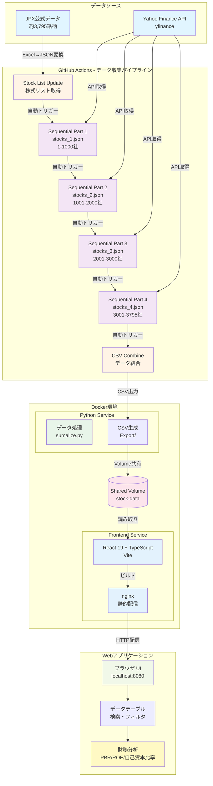

# はじめに/作ったわけ

:::message
**バイブコーディングで作ったアプリの記事になります**
:::

いきなりですが。
海外で働き始めたり旅行したりすると、日本の良さが身に染みたと感じた人は多いんじゃないでしょうか？
なんかとりあえず外で働いてみたいと思っていましたが、今はいつ戻るかと考える日々です。（とにかく温泉に入りたい）

僕は完全にその一人なんですが、、
色々と各国を回る中で、日本企業ってアジア圏や他の国にもかなり進出してるんだなぁと実感しました。（そりゃそう）

そんなこんなで日本株に興味を持ち始め、
昨年に[わが投資術](https://amzn.to/3IEVRkq)見つけて参考にさせていただきながら実践していました。（まだ初めて一年目なので成績はわかりません。。。が、マイナスは無し）

自分でバフェットコードや Claude yfinance mcp などを利用してやってみたものの、せっかくだから、アプリ作って公開してみよう(vibe coding)

そんなノリから、**日本株全銘柄を自動収集・分析できる Web アプリ**を開発しました。

この記事では、粗方の工程と実際にローカルでこれを試す方法を紹介します。
細かいコードなどはそこまで期待しないでください 😅

## 作ったもの

### 📊 [yfinance-jp-screener](https://github.com/testkun08080/yfinance-jp-screener)


_検索部分_

_検索結果(企業名はここでは伏せておきます)_

**主な機能:**

- 📈 JPX 公式データから約 3,795 銘柄を自動取得
- 🔍 財務指標による高速スクリーニング
- 📊 PBR、ROE、自己資本比率などの指標可視化
- ⚙️ GitHub Actions による完全自動データ収集
- 🐳 Docker 環境での簡単デプロイ

# 「わが投資術」との出会い

[わが投資術](https://amzn.to/3IEVRkq)では、**シンプルな指標**で割安株を見つける手法が紹介されています：

- **時価総額**: 500 億以下
- **PBR**: 1 倍以下
- **PER**: 10 倍以下
- **ネットキャッシュ**: （流動資産＋投資有価証券 ×70％）－負債
- **ネットキャッシュ比率**　ネットキャッシュ/時価総額

これらの指標を**自動で取得・分析**できれば、ひとまず「わが投資術」に粗方沿ったスクリーニングができると思います。
なので、これらの基本的なものに加えて、以下のものをフィルタリング出来るようにしていきます。

### 実装済みフィルタリング項目

#### 📋 基本フィルター


- **会社名検索** - テキスト検索（部分一致）
- **銘柄コード検索** - 4 桁のコード検索
- **時価総額** -
- **業種** - 複数選択可能（チェックボックス）
- **優先市場** - プライム/スタンダード/グロース（複数選択）
- **都道府県** - 本社所在地による絞り込み（複数選択）

#### 📊 バリュエーション指標


- **PBR（株価純資産倍率）**
- **ROE（自己資本利益率）**
- **自己資本比率**
- **PER(会予)（予想株価収益率）**

#### 💹 業績・収益性指標


- **売上高**
- **営業利益**
- **営業利益率**
- **当期純利益**
- **純利益率**

#### 🏛️ バランスシート指標


- **負債**
- **流動負債**
- **流動資産**
- **総負債**
- **投資有価証券**

#### 💰 キャッシュ関連指標


- **現金及び現金同等物**
- **ネットキャッシュ**
- **ネットキャッシュ比率**

# 技術スタック

## アーキテクチャ

```text
┌─────────────────────────────────────────────────┐
│         GitHub Actions (データ収集)              │
│  JPX公式 → yfinance API → CSV生成 → Combine     │
└─────────────────┬───────────────────────────────┘
                  │
                  ↓
┌─────────────────────────────────────────────────┐
│              Docker Compose                      │
│  ┌──────────────┐      ┌──────────────────────┐ │
│  │ Python       │      │ React + nginx        │ │
│  │ (データ処理) │ ───→ │ (フロントエンド)      │ │
│  └──────────────┘      └──────────────────────┘ │
└─────────────────────────────────────────────────┘
```

:::details 詳細



:::

## バックエンド（Python）

- **Python 3.11+**
- **yfinance**
- **pandas**

## フロントエンド（React）

- **React 19**
- **TypeScript**
- **Vite**
- **Tailwind CSS + DaisyUI**
- \*_Papa Parse_

## インフラ（GitHub Actions + Docker）

- **GitHub Actions**
- **Docker Compose**
- **nginx**

# 開発のポイント

## 1. データ収集の自動化

### 課題: yfinance API のレート制限

約 3,795 社のデータを Github Actions で一度に取得すると、API のレート制限やタイムアウトが発生します。
（管理上も分けたかったという意図もあります。）

### 解決策: 分割処理

GitHub Actions で**4 段階のワークフロー**を構築し、自動連携させました。

```yaml
# Part 1 → Part 2 → Part 3 → Part 4 → CSV結合
Sequential Stock Fetch - Part 1 (stocks_1.json: 1,000社)
  ↓ 自動トリガー
Sequential Stock Fetch - Part 2 (stocks_2.json: 1,000社)
  ↓ 自動トリガー
Sequential Stock Fetch - Part 3 (stocks_3.json: 1,000社)
  ↓ 自動トリガー
Sequential Stock Fetch - Part 4 (stocks_4.json: 795社)
  ↓ 自動トリガー
CSV Combine & Export (全データ結合)
```

### 実装コード（ワークフロー連携部分）

```yaml
# stock-fetch-sequential-1.yml
name: "📊 Sequential Stock Fetch - Part 1"
on:
  workflow_dispatch:

jobs:
  fetch-part-1:
    runs-on: ubuntu-latest
    timeout-minutes: 120
    steps:
      - name: Checkout
        uses: actions/checkout@v4

      - name: Set up Python
        uses: actions/setup-python@v5
        with:
          python-version: "3.11"

      - name: Install dependencies
        run: |
          cd stock_list
          pip install -r requirements.txt

      - name: Fetch stock data (Part 1)
        run: |
          cd stock_list
          python sumalize.py stocks_1.json

      - name: Commit results
        run: |
          git config user.name "github-actions[bot]"
          git config user.email "github-actions[bot]@users.noreply.github.com"
          git add stock_list/Export/
          git commit -m "📊 Part 1 completed"
          git push

      # 次のワークフローを自動トリガー
      - name: Trigger Part 2
        uses: peter-evans/repository-dispatch@v2
        with:
          token: ${{ secrets.GITHUB_TOKEN }}
          event-type: start-fetch-part-2
```

## 2. データ処理の効率化

### JPX 公式データの活用

```python
# get_jp_stocklist.py（抜粋）
import pandas as pd
import requests
from io import BytesIO

def fetch_jpx_stock_list():
    """JPX公式から最新の株式リストを取得"""
    url = "https://www.jpx.co.jp/markets/statistics-equities/misc/tvdivq0000001vg2-att/data_j.xls"

    response = requests.get(url)
    df = pd.read_excel(BytesIO(response.content))

    # 必要なカラムのみ抽出
    stocks = df[['コード', '銘柄名', '市場・商品区分', '33業種区分']].to_dict('records')

    # JSONで保存
    with open('stocks_all.json', 'w', encoding='utf-8') as f:
        json.dump(stocks, f, ensure_ascii=False, indent=2)

    return stocks
```

#### yfinance での財務データ取得

```python
# sumalize.py（抜粋）
import yfinance as yf
import pandas as pd
from typing import Dict, Any

def fetch_stock_data(ticker: str) -> Dict[str, Any]:
    """個別銘柄の財務データを取得"""
    try:
        stock = yf.Ticker(f"{ticker}.T")  # 東証銘柄には.Tサフィックス
        info = stock.info

        return {
            '銘柄コード': ticker,
            '会社名': info.get('longName', 'N/A'),
            '時価総額': info.get('marketCap', None),
            'PBR': info.get('priceToBook', None),
            'ROE': info.get('returnOnEquity', None),
            '自己資本比率': info.get('debtToEquity', None),
            '営業利益率': info.get('operatingMargins', None),
            # ... その他の指標
        }
    except Exception as e:
        print(f"Error fetching {ticker}: {e}")
        return None

def process_stock_list(json_file: str):
    """株式リストを処理"""
    with open(json_file, 'r', encoding='utf-8') as f:
        stocks = json.load(f)

    results = []
    for stock in stocks:
        data = fetch_stock_data(stock['コード'])
        if data:
            results.append(data)
        time.sleep(1)  # レート制限対策

    # CSVで保存
    df = pd.DataFrame(results)
    timestamp = datetime.now().strftime('%Y%m%d_%H%M%S')
    df.to_csv(f'Export/japanese_stocks_data_{timestamp}.csv',
              index=False, encoding='utf-8-sig')
```

## 3. フロントエンドの実装

### 動的 CSV パース

```typescript
// csvParser.ts
import Papa from "papaparse";

export interface StockData {
  [key: string]: string | number;
}

export const parseCSV = (csvText: string): StockData[] => {
  const result = Papa.parse<StockData>(csvText, {
    header: true,
    dynamicTyping: true,
    skipEmptyLines: true,
    encoding: "UTF-8",
  });

  return result.data;
};

// 日本語金融データのフォーマット
export const formatValue = (value: any, columnName: string): string => {
  if (value === null || value === undefined) return "N/A";

  // パーセンテージ
  if (columnName.includes("率") || columnName.includes("ROE")) {
    return `${(value * 100).toFixed(2)}%`;
  }

  // 金額（億円単位）
  if (columnName.includes("時価総額") || columnName.includes("売上高")) {
    return `${(value / 100000000).toFixed(2)}億円`;
  }

  // 倍率
  if (columnName.includes("PBR") || columnName.includes("PER")) {
    return `${value.toFixed(2)}倍`;
  }

  return value.toString();
};
```

#### リアルタイム検索・フィルタリング

```typescript
// useFilters.ts
import { useMemo, useState } from "react";
import { StockData } from "../types/stock";

export const useFilters = (data: StockData[]) => {
  const [searchTerm, setSearchTerm] = useState("");
  const [pbrMax, setPbrMax] = useState<number | null>(null);
  const [roeMin, setRoeMin] = useState<number | null>(null);

  const filteredData = useMemo(() => {
    return data.filter((stock) => {
      // 検索フィルタ
      const matchesSearch =
        searchTerm === "" ||
        Object.values(stock).some((value) =>
          String(value).toLowerCase().includes(searchTerm.toLowerCase())
        );

      // PBRフィルタ
      const matchesPBR =
        pbrMax === null || (stock.PBR && Number(stock.PBR) <= pbrMax);

      // ROEフィルタ
      const matchesROE =
        roeMin === null || (stock.ROE && Number(stock.ROE) >= roeMin);

      return matchesSearch && matchesPBR && matchesROE;
    });
  }, [data, searchTerm, pbrMax, roeMin]);

  return {
    filteredData,
    searchTerm,
    setSearchTerm,
    pbrMax,
    setPbrMax,
    roeMin,
    setRoeMin,
  };
};
```

## 4. Docker 環境の構築

### docker-compose.yml

```yaml
version: "3.8"

services:
  # データ収集サービス
  python-service:
    build:
      context: ./stock_list
      dockerfile: ../Dockerfile.fetch
    environment:
      - STOCK_FILE=stocks_1.json
    volumes:
      - stock-data:/app/Export
    command: >
      sh -c "
        python get_jp_stocklist.py &&
        python split_stocks.py --input stocks_all.json --size 1000 &&
        python sumalize.py ${STOCK_FILE} &&
        python combine_latest_csv.py
      "

  # フロントエンドサービス
  frontend-service:
    build:
      context: ./stock_search
      dockerfile: ../Dockerfile.app
    ports:
      - "8080:80"
    volumes:
      - stock-data:/usr/share/nginx/html/csv:ro
    depends_on:
      - python-service
    healthcheck:
      test: ["CMD", "curl", "-f", "http://localhost:80"]
      interval: 30s
      timeout: 10s
      retries: 3

volumes:
  stock-data:
    driver: local

networks:
  stock-network:
    driver: bridge
```

# 使い方

## クイックスタート（Docker）

### 事前インストールが必要なもの

- [Docker](https://docs.docker.com/get-started/get-docker/)

```bash
# リポジトリをクローン
git clone https://github.com/testkun08080/yfinance-jp-screener.git
cd yfinance-jp-screener

# Docker Composeで起動
docker-compose up --build

# ブラウザでアクセス
open http://localhost:8080
```

**初回起動時の注意:**
データ収集に約 4 時間かかります（約 3,795 社）。

## ローカル環境での実行

### 事前インストールが必要なもの

- [UV](https://docs.astral.sh/uv/getting-started/installation/)
- [nodejs](https://nodejs.org/en/download)

```bash
# リポジトリをクローン
git clone https://github.com/testkun08080/yfinance-jp-screener.git
cd yfinance-jp-screener

# データ収集
cd stock_list
uv sync
uv run sumalize.py stocks_sample.json  # テスト用（数十社）

# フロントエンド
cd ../stock_search
npm install

# buildしたときにcsvをコピーするスクリプトが走るのでbuildは必須です
npm run build
npm run preview
```

### GitHub Actions での自動収集

1. リポジトリを**プライベート**でフォーク
2. Actions → "Sequential Stock Fetch - Part 1" を実行
3. 約 6〜8 時間後に全データ収集完了
4. `stock_list/Export/` に結合済み CSV が生成される

# 重要な注意事項

## ⚠️ データの取り扱いについて

このプロジェクトは**個人利用・研究・教育目的**でのみ使用してください。

:::message alert
**データの取り扱いは以下を参照ください**

1. Yahoo! Finance Terms of Service
   https://legal.yahoo.com/us/en/yahoo/terms/otos/index.html

2. Yahoo! Developer API Terms of Use
   https://policies.yahoo.com/us/en/yahoo/terms/product-atos/apiforydn/index.htm

3. Yahoo! 権利関係ページ
   https://legal.yahoo.com/us/en/yahoo/permissions/requests/index.html

:::

- API のレート制限を守り、過度なリクエストは避けてください
- 取得したデータの正確性は保証されません

## 参考リンク

- [yfinance GitHub Repository](https://github.com/ranaroussi/yfinance)
- [Yahoo Finance](https://finance.yahoo.com/)
- [日本取引所グループ（JPX）](https://www.jpx.co.jp/)
- [わが投資術（Amazon）](https://amzn.to/3IEVRkq)

---

**免責事項:**
本記事およびアプリケーションは教育・研究目的で作成されたものです。投資判断は自己責任でお願いします。

## その他

もしこの記事が役立ったら、[コーヒ一杯ほど](https://buymeacoffee.com/testkun08080)もらえると最高です

最後までお読みいただきありがとうございます。
それでは 🙏
